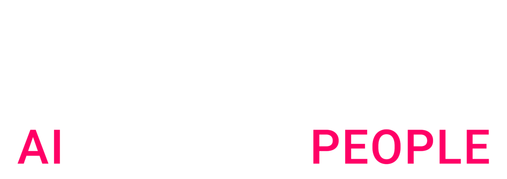

# Vertex Pipelines Deployer
 

    <!-- <h1 align="center">Vertex Pipelines Deployer</h1> -->
    

        
    

    <h3 align="center">Deploy Vertex Pipelines within minutes</h3>
        

        This tool is a wrapper around <a href="https://www.kubeflow.org/docs/components/pipelines/v2/hello-world/">kfp</a> and <a href="https://cloud.google.com/python/docs/reference/aiplatform/latest">google-cloud-aiplatform</a> that allows you to check, compile, upload, run and schedule Vertex Pipelines in a standardized manner.
        

 

!!! info
    This project is looking for beta testers and contributors.

    You can contact code owners or **[submit a new issue](https://github.com/artefactory/vertex-pipelines-deployer/issues/new/choose)** if you want to help.

## Why this tool?

--8<-- "README.md:why"

## Installation

--8<-- "README.md:installation"

## Basic Usage

Please refer to the [Basic Usage](usage.md) page for more information.

## License

This project is licensed under the terms of the Apache 2.0.
